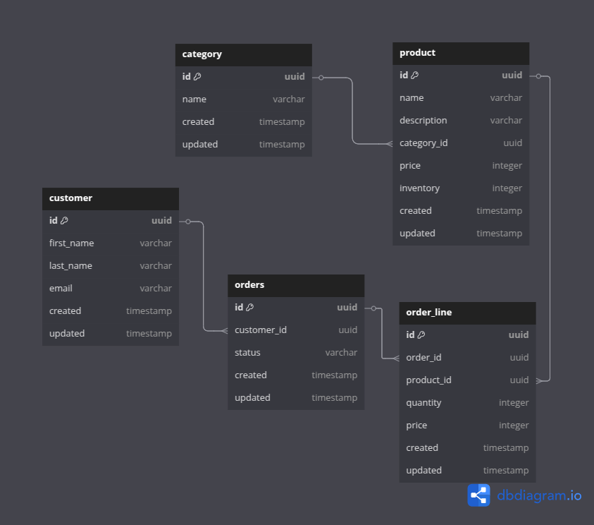

# Using JDBI with Spring Boot

## Databases and Spring Boot

If you've worked on some Spring Boot projects, you've probably needed to interact with a database and there's a good chance that interaction was managed by ORM (object-relational mapping) software and most likely that software was Hibernate. Hibernate is powerful and it does a great job of hiding the details of interacting with a relational database, but it isn't always the right tool for the job. Often, it is tool that is used because it is the default way of interacting with relational databases in Spring Boot rather than being chosen because it's the best tool for the job. That's not to say that it can't be the best tool for the job, but it isn't always the best.

I've worked on a number of Spring projects and I can remember one where shortly after I joined the team I was introduced to a big concern with a project under development. The problem was that Hibernate was generating queries that were very inefficient for the Oracle database it was interacting with. The team manager confessed that using Hibernate might have been a misstep. Hiding the details of interacting with the database can mean hiding inefficient queries or excessive queries. Eventually that project was tamed by some Oracle experts with native queries, but it felt more like we were fighting the tool rather than taking advantage of it.

If you don't want to hide details, then you can just use JDBC to interact with the database, but that requires a lot of code to manage connections, create statements, retrieve fetched data, and map that data into objects. JDBCTemplate can cut out a lot of boilerplate but it will means a lot of work.

Awhile ago I worked on a project with a data access tool that struck a balance that kept the developers in charge of how the Spring application interacted with the project's relational databases, but still took care of a lot of the details. That tool is JDBI.

## So What is JDBI

Jdbi is a tool that gives you the feel of ORM without any magic that hides the database from you. You can get a more complete description on the project website: https://jdbi.org/#_introduction_to_jdbi_3

What it's good at is letting the developer define all the SQL used to interact with the database while handling all the boilerplate and to a large extent most of the mapping of data to objects. That sounds like ORM, but it's not really modeling objects as data in a relational database. Rather, it is just handling the boilerplate code to map columns in a row to properties in a bean or methods in a record or POJO.

## Time for some Code

There's nothing like getting your hands dirty with some code to help understand how things work, so let's get to a demo. This demo code is a Spring Boot project that implements a simple ordering system with products, customers, and orders. I've tried to make a demo that isn't so trivial that it doesn't cover much, but at the same time not letting the demo get very big. So be prepared to look at a fair amount of code, but don't expect anything like a real application.

### Database Schema


This is the database schema we'll be using in the demo. We have products that each have a category, customers, orders that each belong to a customer, and finally order line items that belong to an order and point to a particular product. Each of these entities has few simple attributes.

### The Application Project

Our application will be created with Spring Boot and we'll use Postgres for our database. To manage our project we'll use Maven and we'll use Java 21 to code it. All pretty standard fare.

The application will perform some basic CRUD functionality for categories, products, customers, and orders along with managing order line items. It will then prodvide a REST api for invoking those operations and we'll create unit tests for our Jdbi code.

We'll include Spring Boot Web Starter, Spring Boot JPA Starter, Spring Boot Validation Starter, Flyway for database migrations, Spring Boot devtools, Lombok to reduce boilerplate, and Jdbi of course.

For testing, we'll include the Spring Boot test starter, Testcontainers for Spring, and JUnit Jupiter.

The Maven pom.xml ends up like this.

```xml
<?xml version="1.0" encoding="UTF-8"?>
<project xmlns="http://maven.apache.org/POM/4.0.0" xmlns:xsi="http://www.w3.org/2001/XMLSchema-instance"
	xsi:schemaLocation="http://maven.apache.org/POM/4.0.0 https://maven.apache.org/xsd/maven-4.0.0.xsd">
	<modelVersion>4.0.0</modelVersion>
	<parent>
		<groupId>org.springframework.boot</groupId>
		<artifactId>spring-boot-starter-parent</artifactId>
		<version>3.4.4</version>
		<relativePath/> <!-- lookup parent from repository -->
	</parent>
	<groupId>com.elemlime</groupId>
	<artifactId>jdbidemo</artifactId>
	<version>0.0.1-SNAPSHOT</version>
	<name>jdbidemo</name>
	<description>Demo project for Spring Boot</description>
	<url/>
	<licenses>
		<license>
			<name>The Apache License, Version 2.0</name>
			<url>http://www.apache.org/licenses/LICENSE-2.0.txt</url>
		</license>
	</licenses>
	<properties>
		<java.version>21</java.version>
		<argLine/>
		<mockito.version>5.16.0</mockito.version>
	</properties>
	<dependencies>
		<dependency>
			<groupId>org.springframework.boot</groupId>
			<artifactId>spring-boot-starter-web</artifactId>
		</dependency>
		<dependency>
			<groupId>org.springframework.boot</groupId>
			<artifactId>spring-boot-starter-data-jpa</artifactId>
		</dependency>
		<dependency>
			<groupId>org.springframework.boot</groupId>
			<artifactId>spring-boot-starter-validation</artifactId>
		</dependency>
		<dependency>
			<groupId>org.jdbi</groupId>
			<artifactId>jdbi3-spring5</artifactId>
			<version>3.49.1</version>
		</dependency>
		<dependency>
			<groupId>org.jdbi</groupId>
			<artifactId>jdbi3-postgres</artifactId>
			<version>3.49.1</version>
		</dependency>
		<dependency>
			<groupId>org.jdbi</groupId>
			<artifactId>jdbi3-sqlobject</artifactId>
			<version>3.49.1</version>
		</dependency>
		<dependency>
			<groupId>org.flywaydb</groupId>
			<artifactId>flyway-core</artifactId>
		</dependency>
		<dependency>
			<groupId>org.flywaydb</groupId>
			<artifactId>flyway-database-postgresql</artifactId>
		</dependency>
		<dependency>
			<groupId>org.springframework.boot</groupId>
			<artifactId>spring-boot-devtools</artifactId>
			<scope>runtime</scope>
			<optional>true</optional>
		</dependency>
		<dependency>
			<groupId>org.postgresql</groupId>
			<artifactId>postgresql</artifactId>
			<scope>runtime</scope>
		</dependency>
		<dependency>
			<groupId>org.projectlombok</groupId>
			<artifactId>lombok</artifactId>
			<optional>true</optional>
		</dependency>

		<dependency>
			<groupId>org.springframework.boot</groupId>
			<artifactId>spring-boot-starter-test</artifactId>
			<scope>test</scope>
		</dependency>
		<dependency>
			<groupId>org.springframework.boot</groupId>
			<artifactId>spring-boot-testcontainers</artifactId>
			<scope>test</scope>
		</dependency>
		<dependency>
			<groupId>org.testcontainers</groupId>
			<artifactId>junit-jupiter</artifactId>
			<scope>test</scope>
		</dependency>
		<dependency>
			<groupId>org.testcontainers</groupId>
			<artifactId>postgresql</artifactId>
			<scope>test</scope>
		</dependency>
	</dependencies>

	<build>
		<plugins>
			<plugin>
				<groupId>org.springframework.boot</groupId>
				<artifactId>spring-boot-maven-plugin</artifactId>
				<configuration>
					<excludes>
						<exclude>
							<groupId>org.projectlombok</groupId>
							<artifactId>lombok</artifactId>
						</exclude>
					</excludes>
				</configuration>
			</plugin>
			<plugin>
				<groupId>org.apache.maven.plugins</groupId>
				<artifactId>maven-surefire-plugin</artifactId>
				<version>${maven-surefire-plugin.version}</version>
				<configuration>
					<argLine>
						@{argLine}
						-javaagent:${settings.localRepository}/org/mockito/mockito-core/${mockito.version}/mockito-core-${mockito.version}.jar
						-Xshare:off
					</argLine>
				</configuration>
			</plugin>
		</plugins>
	</build>

</project>

```

Let's focus in on the Jdbi dependencies since this article is about using Jdbi.

```xml
<dependency>
    <groupId>org.jdbi</groupId>
    <artifactId>jdbi3-spring5</artifactId>
    <version>3.49.1</version>
</dependency>
<dependency>
    <groupId>org.jdbi</groupId>
    <artifactId>jdbi3-postgres</artifactId>
    <version>3.49.1</version>
</dependency>
<dependency>
    <groupId>org.jdbi</groupId>
    <artifactId>jdbi3-sqlobject</artifactId>
    <version>3.49.1</version>
</dependency>
```

- jdbi3-spring5 - This is the Spring integration library for Jdbi. Think of Spring5 as meaning Spring version 5+. This will also pull in core Jdbi functionality.
- jdbi3-postgres - This will add support for Postgres databases for Jdbi.
- jdbi3-sqlobject - This brings in row to object mapping for Jdbi. Bringing in this library will give Jdbi an ORM-like feel.

The rest of the project configuration is pretty normal for any Spring Boot project. If you are wondering about the way that surefire is configured. That's for compatibility with future Java versions. It avoids a deprecation warning in Java 21.

```xml
<plugin>
    <groupId>org.apache.maven.plugins</groupId>
    <artifactId>maven-surefire-plugin</artifactId>
    <version>${maven-surefire-plugin.version}</version>
    <configuration>
        <argLine>
            @{argLine}
            -javaagent:${settings.localRepository}/org/mockito/mockito-core/${mockito.version}/mockito-core-${mockito.version}.jar
            -Xshare:off
        </argLine>
    </configuration>
</plugin>
```

Now that the project is defined, we'll move on to setting up the database.

### Setting up Postgres and Creating Migrations

For standing up Postgres, we'll use a docker compose file. It's located at ./docker/docker-compose.yml in the project.

```yaml
services:
  postgres:
    image: postgres:17
    volumes:
      - jdemdb:/var/lib/postgres/jdemdb
    ports:
      - 5432:5432
    environment:
      - POSTGRES_USER=jdemuser
      - POSTGRES_PASSWORD=jdempass
      - POSTGRES_DB=jdemdb
volumes:
  jdemdb:
```

This will pull down the image for Postgres 17 and start it up.

We're using Flyway for the migrations and simply using SQL files for the migrations themselves.

The configuration for connecting to the database and the migrations is in the application.properties file located in ./src/main/resources

```properties
spring.flyway.sql-migration-prefix=V
spring.flyway.repeatable-sql-migration-prefix=R
spring.flyway.sql-migration-separator=__
spring.flyway.sql-migration-suffixes=.sql

spring.flyway.enabled=true
spring.flyway.locations=classpath:db/migration
spring.flyway.baseline-on-migrate=true
spring.flyway.validate-on-migrate=true

spring.datasource.url=jdbc:postgresql://localhost:5432/jdemdb
spring.datasource.username=jdemuser
spring.datasource.password=jdempass
spring.datasource.driver-class-name=org.postgresql.Driver
```

The Flyway properties set us up to have the migration files follow the pattern of V[version]__[name].sql. The location is set to be at db/migration in the classpath. So we'll create our migration files in ./src/main/resources/db/migration and follow the naming pattern we've set.

The first migration will be to set up the tables and will be named "V1__initial_tables.sql"

```sql
CREATE TABLE category (
    id uuid DEFAULT gen_random_uuid() PRIMARY KEY,
    name varchar(128),
    created timestamp,
    updated timestamp
);

CREATE UNIQUE INDEX idx_category_name ON category(name);

CREATE TABLE product (
    id uuid DEFAULT gen_random_uuid() PRIMARY KEY,
    name varchar(128),
    description varchar(128),
    category_id uuid,
    price integer,
    inventory integer,
    created timestamp,
    updated timestamp
);

CREATE INDEX idx_product_category_id ON product(category_id);

CREATE TABLE customer (
    id uuid DEFAULT gen_random_uuid() PRIMARY KEY,
    first_name varchar(128),
    last_name varchar(128),
    email varchar(255),
    created timestamp,
    updated timestamp
);

CREATE UNIQUE INDEX idx_email ON customer(email);

CREATE TABLE orders (
    id uuid DEFAULT gen_random_uuid() PRIMARY KEY,
    customer_id uuid,
    status varchar(16),
    created timestamp,
    updated timestamp
);

CREATE INDEX idx_orders_customer_id ON orders(customer_id);
CREATE INDEX idx_orders_status ON orders(status);

CREATE TABLE order_line (
    id uuid DEFAULT gen_random_uuid() PRIMARY KEY,
    order_id uuid,
    product_id uuid,
    quantity integer,
    price integer,
    created timestamp,
    updated timestamp
);

CREATE INDEX idx_order_line_order_id ON order_line(order_id);
CREATE INDEX idx_order_line_product_id ON order_line(product_id);
```

This is a pretty straightforward implementation of our model. We're using uuids for our ids and we're created indexes for the join columns. The primary keys will have indexes so we don't need to create those. We also create some unique indexes on fields that need to be unique.

We're not using foreign key constraints in this schema. You can find plenty of debates on the merits of using or not using foreign key constraints online, but not using them suits the purposes of this demo. Since that means we also don't have cascading deletes, we'll add a couple more migrations with procedures to help with deleting.

Our second migration is in "V2__delete_order_by_id.sql" which, as the name suggests is a procedure for deleting an order by its id.

```sql
create or replace procedure delete_order_by_id(
    orderid uuid
)
language plpgsql
as $$
begin
    -- Remove order lines
    delete from order_line where order_id=orderid;

    -- Remove from order table
    delete from orders where id=orderid;

    commit;
end;$$;
```
This is pretty straightforward, we'll delete the order lines that correspond to the order id and then delete the order with the order id and we'll do that in a transaction.

The third and final migration is "V3__delete_orders_by_customer.sql" which will delete all orders belonging to a specific customer.

```sql
create or replace procedure delete_orders_by_customer(
    customerid uuid
)
language plpgsql
as $$
begin
    -- Remove order lines
    delete from order_line where order_id in (SELECT id from orders WHERE customer_id=customerid);

    -- Remove orders from order table
    delete from orders where customer_id=customerid;

    commit;
end;$$;
```

This is much like the other procedure, but it uses a subquery to determine all the order ids to match when deleting order lines and then deleting all orders associated with the customer id.

Okay, the database is set up and we have our migrations. Now to get the application set up.

### Setting up the Application

We'll need some configuration for the application and to create the application main class. For configuration, we'll add three more properties to the flyway and postgres properties we already have.

```properties
spring.application.name=jdbidemo
server.port=8080
spring.jpa.open-in-view=false
```

The application name and port are standard fare. We'll also set spring.jpa.open-in-view false so that Spring doesn't automatically create a hibernate session. Since we aren't using hibernate there's no reason to enable it.

Then, the main class for the Spring application is just the normal boilerplate. There's nothing special here to use Jdbi.

```java
package com.elemlime.jdbidemo;

import org.springframework.boot.SpringApplication;
import org.springframework.boot.autoconfigure.SpringBootApplication;

@SpringBootApplication
public class JdbidemoApplication {

	public static void main(String[] args) {
		SpringApplication.run(JdbidemoApplication.class, args);
	}

}

```

### Creating some Models

The next bit of stage setting for our application will be creating some models for our data entities. We'll use Java beans for the entities for easy JSON serialization since our endpoints will be returning the models. Now, in a real application, we wouldn't be returning the entities directly from the endpoints since we'd want to define our API responses independently of our internal representation, but this is a demo so we're taking a shortcut since there is already a fair amount of code as it is.

We'll define a model for a Category.

```java
package com.elemlime.jdbidemo.model;

import java.time.Instant;
import java.util.UUID;
import lombok.AllArgsConstructor;
import lombok.Data;
import lombok.NoArgsConstructor;

@Data
@AllArgsConstructor
@NoArgsConstructor
public class Category {
  private UUID id;
  private String name;
  private Instant created;
  private Instant updated;
}
```

Using lombok allows us to keep the class nice and clean with just the properties defined, leaving it to lombok to generate the getters, settings, constructors, equals, hashcode, and toString methods. We're just using Instants for the timestamps here.

Now we'll define a model for a Customer.

```java
package com.elemlime.jdbidemo.model;

import java.time.Instant;
import java.util.UUID;
import lombok.AllArgsConstructor;
import lombok.Data;
import lombok.NoArgsConstructor;

@Data
@AllArgsConstructor
@NoArgsConstructor
public class Customer {
    private UUID id;
    private String firstName;
    private String lastName;
    private String email;
    private Instant created;
    private Instant updated;
}
```

Nothing especially interesting for this model, but if you remember our data schema, you'll remember that that the Customer table has columns named first_name and last_name. Jdbi will figure out mapping those snake-case names to camel-case names in our model Java bean.

Moving on to the model for a Product.

```java
package com.elemlime.jdbidemo.model;

import java.time.Instant;
import java.util.UUID;
import lombok.AllArgsConstructor;
import lombok.Data;
import lombok.NoArgsConstructor;

@Data
@AllArgsConstructor
@NoArgsConstructor
public class Product {
    private UUID id;
    private String name;
    private String description;
    private String category;
    private Integer price;
    private Integer inventory;
    private Instant created;
    private Instant updated;
}
```

A couple of things to remark on with this model. By using Integer objects instead of primitives, we're allowing the possibility of having null values in the database. Maybe that would indicate that a price is not assigned or that the inventory level is unknown. Again, it's a demo we aren't going to be covering all the possibilities. Also, the category is just a string to contain a category name rather than a reference to a category object. We'll see how we can be flexible with our representation for the data and how it doesn't have to match the columns exactly.

Now let's look at our model for an Order.

```java
package com.elemlime.jdbidemo.model;

import java.time.Instant;
import java.util.ArrayList;
import java.util.List;
import java.util.UUID;
import lombok.AllArgsConstructor;
import lombok.Data;
import lombok.NoArgsConstructor;

@Data
@AllArgsConstructor
@NoArgsConstructor
public class Order {
    private UUID id;
    private OrderStatus status;
    private Instant created;
    private Instant updated;
    private Customer customer;
    private List<OrderLine> orderLines = new ArrayList<>();
}
```

In this model we can see a few things. We can use an enumeration for order status and Jdbi will take care of turning the varchar in the table to an enumeration value. The model also has an embedded Customer property that is the customer that the order is associated with. Finally, it also has a list of order lines that are associated with this order. We'll see how these references are resolved when we look at the order dao.

Finally, let's look at the model for a line item on an order.

```java
package com.elemlime.jdbidemo.model;

import java.time.Instant;
import java.util.UUID;
import lombok.AllArgsConstructor;
import lombok.Data;
import lombok.NoArgsConstructor;

@Data
@NoArgsConstructor
@AllArgsConstructor
public class OrderLine {
    private UUID id;
    private UUID orderId;
    private UUID productId;
    private Integer quantity;
    private String name;
    private String description;
    private Integer price;
    private Instant created;
    private Instant updated;
}
```
In the OrderLine model, we will embed some of the product data in our order line: the name, the description, and the product's id. However, we leave out the product data we don't need for a line time such as the created and updated time and the inventory. The line item has its own price to reflect the price at the time the order was place and not the current price of the product.

### Creating the DAOs

Okay, we are finally going to start using some Jdbi to manage our database. For this demo, we'll create four DAOs to deal with category, customer, product, and orders. Order line items will be managed by the DAO for orders so there isn't a separate DAO for them.

#### Category DAO

Let's take a look at the DAO for Category.

```java
package com.elemlime.jdbidemo.dao;

import com.elemlime.jdbidemo.model.Category;
import java.util.List;
import java.util.Optional;
import java.util.UUID;
import org.jdbi.v3.sqlobject.config.RegisterBeanMapper;
import org.jdbi.v3.sqlobject.customizer.Bind;
import org.jdbi.v3.sqlobject.customizer.Timestamped;
import org.jdbi.v3.sqlobject.statement.GetGeneratedKeys;
import org.jdbi.v3.sqlobject.statement.SqlQuery;

@RegisterBeanMapper(Category.class)
public interface CategoryDao {
  @SqlQuery(
      """
        SELECT id, name, created, updated FROM category ORDER BY name
        """)
  List<Category> getAll();

  @SqlQuery(
      """
        SELECT * FROM category WHERE name = :categoryName
        """)
  Optional<Category> getCategoryByName(@Bind("categoryName") String categoryName);

  @SqlQuery(
      """
      SELECT * FROM category WHERE id = :categoryId
      """)
  Optional<Category> getCategoryById(@Bind UUID categoryId);

  @SqlUpdate(
      """
        INSERT INTO  category (name, created, updated) VALUES (:categoryName, :now, :now)
        RETURNING *
        """)
  @GetGeneratedKeys
  @Timestamped
  Category createCategory(@Bind("categoryName") String categoryName);
}
```
When we define a Jdbi DAO, we create an interface with the method signatures we need and let Jdbi take care of the implementation. How the DAO generates the implementation is determined by annotations. Let's look at how this works in detail.

**Mapping results to a model.**

```java
@RegisterBeanMapper(Category.class)
```
Jdbi provides many useful tools for mapping query results to a model, but here we're going to use the bean mapper to map columns to bean properties. Here, we are telling Jdbi to use the Category bean for mapping. Jdbi will automatically call the setter method for the property name that corresponds to the column name in the result set. In this case, that means the column 'name' will invoke Category.setName(...), 'id' will invoke Category.setId(...) and so forth. Jdbi will also figure out coerecing to the data type. It will also map snake case column names to camel case property names. You can also use the @ColumnName annotation on either the setter or getter of a property to map a column that doesn't match up with the property name.

You can also define a row mapping class to handle the data mapping if you need more control, but that is beyond the scope of this article. There a lot of ways to map data with Jdbi and a visit to jdbi.org will provide information on them all. However, mapping to a bean is one of the most concise and intuitive ways to do it.

**Getting all Categories**
```java
@SqlQuery(
    """
    SELECT id, name, created, updated FROM category ORDER BY name
    """)
List<Category> getAll();
```
This is our method signature for getting all the categories. The @SqlQuery annotation tells Jdbi that this method is performing a select and will be returning data. We can either provide the query right in the annotation or provide it in a file on the classpath. My personal preference is to keep the SQL with the relevent methods so that's what we're doing in this demo. Java text blocks allow the SQL syntax to stay nice and clean.

Jdbi will take care of executing the query and mapping the result set to our return value which is a list of categories. That's all we have to do. If something goes wrong running the query, then a JdbiException will be thrown which is an unchecked exception.

This is all you need to execute a query and return mapped results in the most basic case. As we continue to look at the demo, we'll see more complex scenarios.

**Getting a Category by Id**
```java
@SqlQuery(
    """
    SELECT * FROM category WHERE id = :categoryId
    """)
Optional<Category> getCategoryById(@Bind UUID categoryId);
```
This method signature will get a category by its id. Once again, the @SqlQuery annotation sets the SQL statement to use to get the Category. Jdbi supports both unnamed and named parameters. Unnamed parameters work like JDBC with a '?' representing the parameter and being set by position. Here, we're using a named parameter indicated by the colon followed by the name ":categoryId". The @Bind annotation associates a method parameter with the named parameter in the query. We could also made the binding by adding the query parameter named to the @Bind annotation like "@Bind("categoryId"), but since the name of the method parameter matches, we can omit that annotation value.

We can also see here that we don't need to specify the column names in the select statement and can just use the wildcard '*'.

Since it is possible for the query to not match a row, we can make the return value optional so that it will return an empty value when a match can't be made.

It is also possible to use a method parameter to insert part of the SQL statement itself rather than plugging in a parameter value by using XML style brackets, "&lt;name&gt;" and the @Define annotation. However, this creates a potential vector for SQL injection attacks and must be used with great care. We won't be using that feature in this demo.

**Getting a Category by Name**
```java
@SqlQuery(
    """
    SELECT * FROM category WHERE name = :categoryName
    """)
Optional<Category> getCategoryByName(@Bind("categoryName") String categoryName);
```
This method signature will get the category row by name.

**Creating a Category**
```java
@SqlUpdate(
      """
        INSERT INTO  category (name, created, updated) VALUES (:categoryName, :now, :now)
        RETURNING *
        """)
@GetGeneratedKeys
@Timestamped
Category createCategory(@Bind("categoryName") String categoryName);
```
This method signature will create a new category row in our database. Since we are updating the database, we use the @SqlUpdate annotation for our SQL statement. We also use the @GetGeneratedKeys annotation to return our newly created category. It maps the columns from 'RETURNING *' into the Category bean just like we did with our select methods.

The @Timestamped annotation provides the current time as another parameter named ":now" that we can insert into our SQL statement. This lets us just pass in the category name to the method and still be able to insert the current time for the created and udpated columns.

#### CustomerDao

Let's look at the code for our customer DAO. There's not anything especially new with this one; it just has more columns to deal with and adds methods for updating and deleting a customer.

```java
package com.elemlime.jdbidemo.dao;

import com.elemlime.jdbidemo.model.Customer;
import java.util.List;
import java.util.Optional;
import java.util.UUID;
import org.jdbi.v3.sqlobject.config.RegisterBeanMapper;
import org.jdbi.v3.sqlobject.customizer.Bind;
import org.jdbi.v3.sqlobject.customizer.Timestamped;
import org.jdbi.v3.sqlobject.statement.GetGeneratedKeys;
import org.jdbi.v3.sqlobject.statement.SqlQuery;
import org.jdbi.v3.sqlobject.statement.SqlUpdate;

@RegisterBeanMapper(Customer.class)
public interface CustomerDao {
  @SqlQuery(
      """
        SELECT id, first_name, last_name, email, created, updated
        FROM customer
        ORDER BY last_name, first_name
       """)
  List<Customer> getAll();

  @SqlQuery(
      """
      SELECT id, first_name, last_name, email, created, updated FROM customer WHERE id = :id
      """)
  Optional<Customer> getCustomerById(@Bind UUID id);

  @SqlUpdate(
      """
      UPDATE customer SET first_name = :firstName, last_name = :lastName, email = :email, updated = :now
      WHERE id = :id
      RETURNING *
      """)
  @GetGeneratedKeys
  @Timestamped
  Customer updateCustomer(@Bind UUID id, @Bind String email, @Bind String firstName, @Bind String lastName);

  @SqlUpdate(
      """
      INSERT INTO customer (first_name, last_name, email, created, updated)
      VALUES  (:firstName, :lastName, :email, :now, :now)
      RETURNING *
      """)
  @GetGeneratedKeys
  @Timestamped
  Customer createCustomer(@Bind String email, @Bind String firstName, @Bind String lastName);

  @SqlUpdate(
    """
    DELETE FROM customer WHERE id = :id
    """
  )
  void deleteCustomer(@Bind UUID id);
}
```

The delete method signature is noteable only it is the first example of a method signature which doesn't return a value.

#### Product DAO

Let's look at the product DAO next. There will be a couple of different things in this one.

```java
package com.elemlime.jdbidemo.dao;

import com.elemlime.jdbidemo.model.Product;
import com.elemlime.jdbidemo.model.dto.ProductDto;
import java.util.List;
import java.util.Optional;
import java.util.UUID;
import org.jdbi.v3.sqlobject.config.RegisterBeanMapper;
import org.jdbi.v3.sqlobject.customizer.Bind;
import org.jdbi.v3.sqlobject.customizer.BindBean;
import org.jdbi.v3.sqlobject.customizer.Timestamped;
import org.jdbi.v3.sqlobject.statement.GetGeneratedKeys;
import org.jdbi.v3.sqlobject.statement.SqlQuery;
import org.jdbi.v3.sqlobject.statement.SqlUpdate;

@RegisterBeanMapper(Product.class)
public interface ProductDao {
  String SELECT_FROM_PRODUCT_TABLE =
      """
     SELECT p.id, p.name, p.description, c.name AS category, p.price, p.inventory, p.created, p.updated
     FROM product p INNER JOIN category c ON p.category_id = c.id
   """;

  @SqlQuery(SELECT_FROM_PRODUCT_TABLE + " ORDER BY c.name, p.name")
  List<Product> getAll();

  @SqlQuery(SELECT_FROM_PRODUCT_TABLE + " WHERE p.category_id = :categoryId ORDER BY p.name")
  List<Product> getByCategory(@Bind("categoryId") UUID id);

  @SqlQuery(SELECT_FROM_PRODUCT_TABLE + " WHERE p.id = :productId")
  Optional<Product> getById(@Bind("productId") UUID id);

  @SqlUpdate("""
      INSERT INTO product (name, description, category_id, price, inventory, created, updated)
      VALUES (:name, :description, :categoryId, :price, :inventory, :now, :now)
      """)
  @Timestamped
  @GetGeneratedKeys("id")
  UUID createProduct(@BindBean ProductDto product);

  @SqlUpdate("""
      UPDATE product SET category_id = :categoryId, name = :name, description = :description, price = :price, inventory = :inventory, updated = :now
      WHERE id = :productId
      """)
  @Timestamped
  void updateProduct(@Bind UUID productId, @BindBean ProductDto product);

  @SqlUpdate("""
    UPDATE product SET price = :price, updated = :now WHERE id = :productId
    """)
  @Timestamped
  void updatePrice(@Bind UUID productId, @Bind int price);

  @SqlUpdate("""
    UPDATE product SET inventory = :inventory, updated = :now WHERE id = :productId
    """)
  @Timestamped
  void updateInventory(@Bind UUID productId, @Bind int inventory);
}
```

Let's look at the select statement fragemnt we use in all the select statements in this DAO. 
```java
String SELECT_FROM_PRODUCT_TABLE =
      """
     SELECT p.id, p.name, p.description, c.name AS category, p.price, p.inventory, p.created, p.updated
     FROM product p INNER JOIN category c ON p.category_id = c.id
   """;
```
This statement uses a join. Our product bean has the category name which isn't part of the product table so we get it by joining with the category table. Then we alias the result column as 'category' so it matches the bean property. We could have also used @ColumnName annotation in the Product bean on either the setter or getter for the category property to do tha mapping.

Now let's look at the createProduct method signature to see a couple of new things.
```java
@SqlUpdate("""
    INSERT INTO product (name, description, category_id, price, inventory, created, updated)
    VALUES (:name, :description, :categoryId, :price, :inventory, :now, :now)
    """)
@Timestamped
@GetGeneratedKeys("id")
UUID createProduct(@BindBean ProductDto product);
```
We can see a slightly different usage of the @GetGeneratedKeys annotation. This time, we just return the "id" primary key as specified by the annotation value. At least in Postgres, we don't have to specify returning the primary key so we can just use the basic INSERT SQL statement.

Instead of passing in all the needed query parameters as individual parameters with @Bind annotation, we use a data transfer object which is implemented as a java bean.

This is the class for the bean.
```java
package com.elemlime.jdbidemo.model.dto;

import java.util.UUID;
import lombok.AllArgsConstructor;
import lombok.Data;
import lombok.NoArgsConstructor;

@Data
@NoArgsConstructor
@AllArgsConstructor
public class ProductDto {
  private String name;
  private String description;
  private UUID categoryId;
  private int price;
  private int inventory;
}
```
We use the @BindBean annotation to map the property names in the bean to the names of the query parameters. This lets us pass in a number of parameters in a less awkward manner than having them all in the method signature.

Finally, let's look at the last couple of update statements in our DAO.
```java
@SqlUpdate("""
  UPDATE product SET price = :price, updated = :now WHERE id = :productId
  """)
@Timestamped
void updatePrice(@Bind UUID productId, @Bind int price);

@SqlUpdate("""
  UPDATE product SET inventory = :inventory, updated = :now WHERE id = :productId
  """)
@Timestamped
void updateInventory(@Bind UUID productId, @Bind int inventory);
```
Jdbi makes it easy to do very specific actions like updating a single column in a table like we are doing with these two udpates. This can be useful in preventing unintentional updates which can happen when doing a save on a hibernate entity.

#### Order Dao

This is the DAO where things get interesting. Let's take a look.
```java
package com.elemlime.jdbidemo.dao;

import com.elemlime.jdbidemo.model.Customer;
import com.elemlime.jdbidemo.model.Order;
import com.elemlime.jdbidemo.model.OrderLine;
import com.elemlime.jdbidemo.model.OrderStatus;
import com.elemlime.jdbidemo.model.dto.OrderLineDto;
import java.util.List;
import java.util.Map;
import java.util.Optional;
import java.util.UUID;
import org.jdbi.v3.core.result.LinkedHashMapRowReducer;
import org.jdbi.v3.core.result.RowView;
import org.jdbi.v3.sqlobject.config.RegisterBeanMapper;
import org.jdbi.v3.sqlobject.customizer.Bind;
import org.jdbi.v3.sqlobject.customizer.BindMethods;
import org.jdbi.v3.sqlobject.customizer.Timestamped;
import org.jdbi.v3.sqlobject.statement.GetGeneratedKeys;
import org.jdbi.v3.sqlobject.statement.SqlCall;
import org.jdbi.v3.sqlobject.statement.SqlQuery;
import org.jdbi.v3.sqlobject.statement.SqlUpdate;
import org.jdbi.v3.sqlobject.statement.UseRowReducer;

@RegisterBeanMapper(value = Order.class, prefix = "o")
@RegisterBeanMapper(value = Customer.class, prefix = "c")
@RegisterBeanMapper(value = OrderLine.class, prefix = "l")
public interface OrderDao {
  String ORDER_SELECT =
      """
      SELECT o.id o_id, o.status o_status, o.created o_created, o.updated o_updated, l.id l_id,
      l.product_id l_product_id, p.name l_name, p.description l_description, l.quantity l_quantity,
      l.price l_price, l.created l_created, l.updated l_updated, c.id c_id, c.first_name c_firstName,
      c.last_name c_lastName, c.email c_email, c.created c_created, c.updated c_updated
      FROM orders o INNER JOIN customer c ON o.customer_id=c.id
      LEFT OUTER JOIN order_line l ON o.id = l.order_id LEFT OUTER JOIN product p ON l.product_id = p.id
    """;

  @SqlQuery(ORDER_SELECT + "ORDER BY o.updated")
  @UseRowReducer(OrderReducer.class)
  List<Order> getAll();

  @SqlQuery(ORDER_SELECT + " WHERE o.id=:orderId")
  @UseRowReducer(OrderReducer.class)
  Optional<Order> getById(@Bind UUID orderId);

  @SqlQuery(
      """
      SELECT id l_id, order_id l_order_id, product_id l_product_id, quantity l_quantity, price l_price, created l_created, updated l_updated
      FROM order_line
      WHERE id=:orderLineId
      """)
  Optional<OrderLine> getOrderLineById(@Bind UUID orderLineId);

  @SqlUpdate(
      "INSERT INTO orders (customer_id, status, created, updated) VALUES (:customerId, :status, :now, :now)")
  @Timestamped
  @GetGeneratedKeys("id")
  UUID createOrder(@Bind UUID customerId, @Bind OrderStatus status);

  @SqlUpdate("UPDATE orders SET status=:status, updated=:now WHERE id=:id")
  @Timestamped
  void updateOrderStatus(@Bind UUID id, @Bind OrderStatus status);

  @SqlUpdate("UPDATE orders SET updated=:now WHERE id=:id")
  @Timestamped
  void updated(@Bind UUID id);

  @SqlUpdate(
      """
    INSERT INTO order_line (order_id, product_id, quantity, price, created, updated)
    VALUES (:orderId, :productId, :quantity, :price, :now, :now)
    """)
  @Timestamped
  @GetGeneratedKeys("id")
  UUID addOrderLine(@BindMethods OrderLineDto orderLineDto);

  @SqlUpdate("DELETE FROM order_line WHERE id=:orderLineId")
  void deleteOrderLine(@Bind UUID orderLineId);

  @SqlCall("call delete_order_by_id(:orderId)")
  void deleteOrder(@Bind UUID orderId);

  @SqlCall("call delete_orders_by_customer(:customerId)")
  void deleteOrdersByCustomer(@Bind UUID customerId);

  class OrderReducer implements LinkedHashMapRowReducer<UUID, Order> {

    @Override
    public void accumulate(Map<UUID, Order> map, RowView rowView) {
      Order order =
          map.computeIfAbsent(
              rowView.getColumn("o_id", UUID.class), id -> rowView.getRow(Order.class));
      if (order.getCustomer() == null) {
        order.setCustomer(rowView.getRow(Customer.class));
      }
      if (rowView.getColumn("l_id", UUID.class) != null) {
        var orderLine = rowView.getRow(OrderLine.class);
        orderLine.setOrderId(order.getId());
        order.getOrderLines().add(orderLine);
      }
    }
  }
}
```
This DAO has plenty of differences from the others since we are doing more complicated stuff. The Order bean has a Customer bean embedded in it, and a list of OrderLine beans. To make it even more complicated each OrderLine bean has properties that come from the associated product. That means we're going to be pulling data from mutli-join queries.

To accomplish this, we define multiple bean mappers for this DAO.
```java
@RegisterBeanMapper(value = Order.class, prefix = "o")
@RegisterBeanMapper(value = Customer.class, prefix = "c")
@RegisterBeanMapper(value = OrderLine.class, prefix = "l")
public interface OrderDao {
```
We're registering three bean mappers for the beans Order, Customer, and OrderLine. Since there are overlapping property names we can define a prefix to keep them deliniated. Result set columns with the prefix string + underscore will then be mapped to the appropriate bean. So "o_" for columns to map to Order, "c_" for columns to map to Customer, and "l_" for columns to map to OrderLine.

With our bean mappers set up, let's look at the select statement fraqument our select queries will share.
```java
String ORDER_SELECT =
      """
      SELECT o.id o_id, o.status o_status, o.created o_created, o.updated o_updated, l.id l_id,
      l.product_id l_product_id, p.name l_name, p.description l_description, l.quantity l_quantity,
      l.price l_price, l.created l_created, l.updated l_updated, c.id c_id, c.first_name c_firstName,
      c.last_name c_lastName, c.email c_email, c.created c_created, c.updated c_updated
      FROM orders o INNER JOIN customer c ON o.customer_id=c.id
      LEFT OUTER JOIN order_line l ON o.id = l.order_id LEFT OUTER JOIN product p ON l.product_id = p.id
    """;
```

We prefix the columns in our result set to match the mappers we've defined, pulling the valuies from the four tables involved. An order always has a customer association, so we make an inner join to the customer table. An order may not have any order lines and by extension may not be associated with any products so the order_line table and product tables are joined via outer joins.

Most of the method signatures in the OrderDao are similar to what we saw in the other DAOs, however there are a couple of important new annotations used here: @UseRowReducer, @BindMethods, and @SqlCall.

**Using a Row Reducer**

Let's look at the method signature for getting all the orders.
```java
@SqlQuery(ORDER_SELECT + "ORDER BY o.updated")
@UseRowReducer(OrderReducer.class)
List<Order> getAll();
```

We've got a new annotation here. You may recall when introducting Jdbi in this article, I said that Jdbi wasn't actually ORM software and this is where it shows. The @UseRowReducer annotation spcifies a class that is used to make care of the nested objects when a data entity has references to other entities. In this case, the Order bean has a Customer bean in it and a list of OrderLine beans. So this part is self-servce, but it isn't a lot of code.

Let's take a look at the reducer class used here.
```java
class OrderReducer implements LinkedHashMapRowReducer<UUID, Order> {

  @Override
  public void accumulate(Map<UUID, Order> map, RowView rowView) {
    Order order =
        map.computeIfAbsent(
            rowView.getColumn("o_id", UUID.class), id -> rowView.getRow(Order.class));
    if (order.getCustomer() == null) {
      order.setCustomer(rowView.getRow(Customer.class));
    }
    if (rowView.getColumn("l_id", UUID.class) != null) {
      var orderLine = rowView.getRow(OrderLine.class);
      orderLine.setOrderId(order.getId());
      order.getOrderLines().add(orderLine);
    }
  }
}
```
We accumulate Order beans into a map of order ids to Order beans. The first thing we do is create an Order bean if it doesn't already exist. With these joins we'll have the same order information showing up for each line item in the order, so we need to reduce them to the distinct orders in the result set.
```java
Order order =
      map.computeIfAbsent(
          rowView.getColumn("o_id", UUID.class), id -> rowView.getRow(Order.class));
```
To get the value of the order id, we get the value from the primary key column orders.id which is named "o_id" in the result set which is done with `rowView.getColumn("o_id", UUID.class)` taking the name of the column in the result set and the class to put map the value to.

To get the Order bean we use `rowView.getRow(Order.class)`. This method will create an Order bean using the bean mapper we registered for the Order class.

Each order row has a 1 to 1 relationship with a customer so we'll as we go through the result set rows, well only add a customer to our order if we haven't already done so.
```java
if (order.getCustomer() == null) {
  order.setCustomer(rowView.getRow(Customer.class));
}
```

For the order lines, we have a many to one relationship with an order and it is an outer join so the order line columns may be null. So what we'll do is first check to see if the primary key column for an order line is not null. In that case we have an order line to add to our order so we'll create an OrderLine bean with our bean mapper. We don't include the order_line.order_id value in our query, but we know the order id so we'll populate that in our bean. Then we add it to the order.
```java
if (rowView.getColumn("l_id", UUID.class) != null) {
  var orderLine = rowView.getRow(OrderLine.class);
  orderLine.setOrderId(order.getId());
  order.getOrderLines().add(orderLine);
}
```

**Binding to Methods**

If we look at the method signature for creating an order line item, we'll see another new annotation used. The method parameter has the @BindMethods annotation.
```java
@SqlUpdate(
      """
    INSERT INTO order_line (order_id, product_id, quantity, price, created, updated)
    VALUES (:orderId, :productId, :quantity, :price, :now, :now)
    """)
  @Timestamped
  @GetGeneratedKeys("id")
  UUID addOrderLine(@BindMethods OrderLineDto orderLineDto);
```
This annotation uses the methods of the object passed in to map to the parameters in the SQL statement. This means we don't have to use a bean to pass in values from an object. In this case, we are using a java record to pass in our values.
```java
package com.elemlime.jdbidemo.model.dto;

import java.util.UUID;

public record OrderLineDto(UUID orderId, UUID productId, int quantity, int price) {}
```
A record will have getters with the same name as the fields in the class: orderId, productId, quantity, and price. We could also have a regular POJO (Plain OLd Java Object) with the same method names and bind to methods as well.

**Calling Procedures**

There's one final new thing in this DAO and that's making procedure calls. We don't have foreign key contraints with cascading deletes so we have some procedures for make that easier and we can call them with Jdbi using the same logic we do with @SqlQuery and @SqlUpdate annotated methods.

Let's take a look.
```java
@SqlCall("call delete_order_by_id(:orderId)")
void deleteOrder(@Bind UUID orderId);

@SqlCall("call delete_orders_by_customer(:customerId)")
void deleteOrdersByCustomer(@Bind UUID customerId);
```
Jdbi provides the @SqlCall annotation for making a procedure call. We can bind method parameters to parameters in the procedure call just like we do with SQL statements. These procedures do not return values, but there is an @OutParameter annotation for handling output from the procedure for one or more values.

### Configuring Jdbi

He have the DAOs written so now we need to hook them into Spring, so we need to write a Spring configuration file which we'll do with annotated java code.

In our config package, we'll create a JdbiConfiguration.java file.
```java
package com.elemlime.jdbidemo.config;

import com.elemlime.jdbidemo.dao.CategoryDao;
import com.elemlime.jdbidemo.dao.CustomerDao;
import com.elemlime.jdbidemo.dao.OrderDao;
import com.elemlime.jdbidemo.dao.ProductDao;
import java.util.List;
import javax.sql.DataSource;
import org.jdbi.v3.core.Jdbi;
import org.jdbi.v3.core.mapper.RowMapper;
import org.jdbi.v3.core.spi.JdbiPlugin;
import org.jdbi.v3.postgres.PostgresPlugin;
import org.jdbi.v3.sqlobject.SqlObjectPlugin;
import org.slf4j.Logger;
import org.slf4j.LoggerFactory;
import org.springframework.context.annotation.Bean;
import org.springframework.context.annotation.Configuration;
import org.springframework.jdbc.datasource.TransactionAwareDataSourceProxy;
import org.springframework.transaction.annotation.EnableTransactionManagement;

@Configuration
@EnableTransactionManagement
public class JdbiConfiguration {
    private final static Logger log = LoggerFactory.getLogger(JdbiConfiguration.class);

    @Bean
    public Jdbi jdbi(DataSource ds, List<JdbiPlugin> plugins, List<RowMapper<?>> mappers) {
        TransactionAwareDataSourceProxy proxy = new TransactionAwareDataSourceProxy(ds);
        Jdbi jdbi = Jdbi.create(proxy);
        jdbi.installPlugin(new SqlObjectPlugin());
        jdbi.installPlugin(new PostgresPlugin());

        log.info("Installing Plugins... ({} found)", plugins.size());
        plugins.forEach(jdbi::installPlugin);

        log.info("Installing Mappers... ({} found)", mappers.size());
        mappers.forEach(jdbi::registerRowMapper);
        return jdbi;
    }
    
    @Bean
    public CategoryDao categoryDao(Jdbi jdbi) {
        return jdbi.onDemand(CategoryDao.class);
    }
    
    @Bean
    public ProductDao productDao(Jdbi jdbi) {
        return jdbi.onDemand(ProductDao.class);
    }
    
    @Bean
    public CustomerDao customerDao(Jdbi jdbi) {
        return jdbi.onDemand(CustomerDao.class);
    }
    
    @Bean
    public OrderDao orderDao(Jdbi jdbi) {
        return jdbi.onDemand(OrderDao.class);
    }
}
```
Let's take a look at how the configuration wires things together, starting with the annotations on the class.
```java
@Configuration
@EnableTransactionManagement
public class JdbiConfiguration {
```
Both of these annotations come from Spring, not Jdbi. The @Configuration annotation tells Spring that this class is providing Spring configuration, and the @EnableTransactionManagement tells Spring to enable using the @Transactional annotation to perform actions in a method in a single DB transaction.

We now need to define a Jdbi bean which will wire Jdbi into your Spring application.
```java
@Bean
public Jdbi jdbi(DataSource ds, List<JdbiPlugin> plugins, List<RowMapper<?>> mappers) {
    TransactionAwareDataSourceProxy proxy = new TransactionAwareDataSourceProxy(ds);
    Jdbi jdbi = Jdbi.create(proxy);
    jdbi.installPlugin(new SqlObjectPlugin());
    jdbi.installPlugin(new PostgresPlugin());

    log.info("Installing Plugins... ({} found)", plugins.size());
    plugins.forEach(jdbi::installPlugin);

    log.info("Installing Mappers... ({} found)", mappers.size());
    mappers.forEach(jdbi::registerRowMapper);
    return jdbi;
}
```
We wrap the DataSource in a TransactionAwareDataSourceProxy so that we can use the @Transactional annotation and then create the Jdbi instance using that proxy. Then we install our plugins. Here, we explicitly include the SqlObjectPlugin which allows us to use the annotations we've used in our DAOs. Then we register all the plugins and mappers we've defined. While he haven't defined any plugins, we have defined a number of row mappers by using the @RegisterBeanMapper annotation.

In order to inject the DAOs we've defined, we need to create beans that will create the DAO implementations for the DAO interfaces we've created.
```java
@Bean
public CategoryDao categoryDao(Jdbi jdbi) {
    return jdbi.onDemand(CategoryDao.class);
}

@Bean
public ProductDao productDao(Jdbi jdbi) {
    return jdbi.onDemand(ProductDao.class);
}

@Bean
public CustomerDao customerDao(Jdbi jdbi) {
    return jdbi.onDemand(CustomerDao.class);
}

@Bean
public OrderDao orderDao(Jdbi jdbi) {
    return jdbi.onDemand(OrderDao.class);
}
```
We do this by calling `jdbi.onDemand` for the interfaces we want implemented.

### The Service Layer

With our data layer written using Jdbi, let's move on to looking at our service layer. Since this demo is all about Jdbi and the data layer, we won't spend a lot of time here. There is also plenty of business logic missing in this service so as to not clutter up the focus on data access.

Our services consist of an interface which defines the contract and provides easy mocking for unit tests and an implementation of that interface.

We'll just look at the service for orders since the others follow the same pattern and the service for orders is the most complex one.

The OrderService interface is defined as follows.
```java
package com.elemlime.jdbidemo.service;

import com.elemlime.jdbidemo.model.Order;
import com.elemlime.jdbidemo.model.OrderStatus;
import java.util.List;
import java.util.UUID;

public interface OrderService {

  List<Order> listAll();

  Order findById(UUID orderId);

  UUID create(UUID customerId);

  void updateStatus(UUID orderId, OrderStatus status);

  UUID addOrderLine(UUID orderId, UUID productId, int quantity);

  void deleteOrderLine(UUID orderLineId);

  void delete(UUID orderId);

  void deleteOrdersForCustomer(UUID customerId);
}
```

The implementation of the service is provided by OrderServiceImpl.java
```java
package com.elemlime.jdbidemo.service.impl;

import com.elemlime.jdbidemo.dao.CustomerDao;
import com.elemlime.jdbidemo.dao.OrderDao;
import com.elemlime.jdbidemo.dao.ProductDao;
import com.elemlime.jdbidemo.exception.DBConsistencyException;
import com.elemlime.jdbidemo.exception.RowNotFoundException;
import com.elemlime.jdbidemo.model.Order;
import com.elemlime.jdbidemo.model.OrderStatus;
import com.elemlime.jdbidemo.model.dto.OrderLineDto;
import com.elemlime.jdbidemo.service.OrderService;
import java.util.List;
import java.util.UUID;
import org.springframework.stereotype.Service;
import org.springframework.transaction.annotation.Transactional;

@Service
public class OrderServiceImpl implements OrderService {
  private final OrderDao orderDao;
  private final CustomerDao customerDao;
  private final ProductDao productDao;

  public OrderServiceImpl(OrderDao orderDao, CustomerDao customerDao, ProductDao productDao) {
    this.orderDao = orderDao;
    this.customerDao = customerDao;
    this.productDao = productDao;
  }

  @Override
  public List<Order> listAll() {
    return orderDao.getAll();
  }

  @Override
  public Order findById(UUID orderId) {
    return orderDao
        .getById(orderId)
        .orElseThrow(
            () -> new RowNotFoundException(String.format("Order with id %s not found", orderId)));
  }

  @Override
  public UUID create(UUID customerId) {
    var customer =
        customerDao
            .getCustomerById(customerId)
            .orElseThrow(
                () ->
                    new RowNotFoundException(
                        String.format("Customer with id %s not found", customerId)));
    return orderDao.createOrder(customer.getId(), OrderStatus.CREATED);
  }

  @Override
  public void updateStatus(UUID orderId, OrderStatus status) {
    orderDao.updateOrderStatus(orderId, status);
  }

  @Override
  @Transactional
  public UUID addOrderLine(UUID orderId, UUID productId, int quantity) {
    var order =
        orderDao
            .getById(orderId)
            .orElseThrow(
                () ->
                    new RowNotFoundException(String.format("Order with id %s not found", orderId)));
    var product =
        productDao
            .getById(productId)
            .orElseThrow(
                () ->
                    new RowNotFoundException(
                        String.format("Product with id %s not found", productId)));
    if (product.getInventory() < quantity) {
      throw new IllegalArgumentException(
          String.format("Quantity %d exceeds inventory %d", quantity, product.getInventory()));
    }
    productDao.updateInventory(productId, product.getInventory() - quantity);
    var orderLine = new OrderLineDto(order.getId(), productId, quantity, product.getPrice());
    orderDao.updated(orderId);
    return orderDao.addOrderLine(orderLine);
  }

  @Override
  @Transactional
  public void deleteOrderLine(UUID orderLineId) {
    var orderLine =
        orderDao
            .getOrderLineById(orderLineId)
            .orElseThrow(
                () ->
                    new RowNotFoundException(
                        String.format("Order line with id %s not found", orderLineId)));
    var product =
        productDao
            .getById(orderLine.getProductId())
            .orElseThrow(
                () ->
                    new DBConsistencyException(
                        String.format(
                            "Product with id %s not found but specified in order line %s",
                            orderLine.getProductId(), orderLine.getId())));
    productDao.updateInventory(product.getId(), product.getInventory() + orderLine.getQuantity());
    orderDao.deleteOrderLine(orderLineId);
  }

  @Override
  public void delete(UUID orderId) {
    orderDao.deleteOrder(orderId);
  }

  @Override
  public void deleteOrdersForCustomer(UUID customerId) {
    orderDao.deleteOrdersByCustomer(customerId);
  }
}
```

**Constructing the Order Service Implementation**

We use the @Service annotation to tell Spring this is an injectable Object for its implemented interface. We'll then use constructor injection to get the needed DAOs and set the corresponding members of this class.
```java
@Service
public class OrderServiceImpl implements OrderService {
  private final OrderDao orderDao;
  private final CustomerDao customerDao;
  private final ProductDao productDao;

  public OrderServiceImpl(OrderDao orderDao, CustomerDao customerDao, ProductDao productDao) {
    this.orderDao = orderDao;
    this.customerDao = customerDao;
    this.productDao = productDao;
  }
```

**Listing all Orders**

If we look at the implementation of the method for listing all orders, we find it's very simple.
```java
@Override
public List<Order> listAll() {
  return orderDao.getAll();
}
```
It just returns the result of calling `getAll()` on the DAO. If a JdbiException is thrown, it'll be handled by our centralized exception handling. If this was a real application we'd also map our internal represention of order to our API defined representation of an order here, but we're just returning the internal representation since this is just a demo.

**Finding an Order**

Here, the DAO returns an Optional when we call `orderDao.getById(orderId)` so we'll use the `orElseThrow` method to turn the optional into an Order, throwing an appropriate exception if the Optional doesn't have a value.
```java
@Override
public Order findById(UUID orderId) {
  return orderDao
      .getById(orderId)
      .orElseThrow(
          () -> new RowNotFoundException(String.format("Order with id %s not found", orderId)));
}
```

**Creating an Order**

When creating an order, we first check to make sure that the specified customer exists and then simply call the `orderDao.createOrder` method of the DAO. The method then returns the id of the newly created order.

```java
@Override
public UUID create(UUID customerId) {
  var customer =
      customerDao
          .getCustomerById(customerId)
          .orElseThrow(
              () ->
                  new RowNotFoundException(
                      String.format("Customer with id %s not found", customerId)));
  return orderDao.createOrder(customer.getId(), OrderStatus.CREATED);
}
```

**Updating the Order Status**

Updating the order status is just a passthrough to the DAO.
```java
@Override
public void updateStatus(UUID orderId, OrderStatus status) {
  orderDao.updateOrderStatus(orderId, status);
}
```

**Added a Line Item to an Order**

Adding a line item to an order is a bit more complicated than what we've done so far. When adding a line item to an order we need to add a row to the order_line table of course, but we also need to subtract the quantity of that line item from our inventory for the product involved, and we need to update the updated timestamp to the orders row.
```java
@Override
@Transactional
public UUID addOrderLine(UUID orderId, UUID productId, int quantity) {
  var order =
      orderDao
          .getById(orderId)
          .orElseThrow(
              () ->
                  new RowNotFoundException(String.format("Order with id %s not found", orderId)));
  var product =
      productDao
          .getById(productId)
          .orElseThrow(
              () ->
                  new RowNotFoundException(
                      String.format("Product with id %s not found", productId)));
  if (product.getInventory() < quantity) {
    throw new IllegalArgumentException(
        String.format("Quantity %d exceeds inventory %d", quantity, product.getInventory()));
  }
  productDao.updateInventory(productId, product.getInventory() - quantity);
  var orderLine = new OrderLineDto(order.getId(), productId, quantity, product.getPrice());
  orderDao.updated(orderId);
  return orderDao.addOrderLine(orderLine);
}
```

Since we are updating three tables and we only want to update them all if all the updates succeed, we want to do all these operations as a single transaction. Thus, we use the @Transactional annotation for this method. This Spring annotation will wrap all our Jdbi operations into a database transaction. It's important to remember that this annotation works because our service implementation is wrapped in a proxy by Spring when it is injected which means that the anntation won't be applied if the method is called from another method in the same class or from an instance of this service that is constructed directly and not injected by Spring.

The rest of the logic doesn't do anything new. We get the order and product involved and make sure they both exist. Then we make sure there is enough inventory to fufill the order. We're going to overlook the potential race condition here since it is a demo.

Then we update the product with the new inventory, update the timestamp on the order, and add the order line. We return the id of the newly created line item.

**Deleting a Line Item from an Order**

This is very similar to adding a line item, only we are adding the quantity back to the product's inventory. Once again we are updating three tables and we only want to to perform updates if all the updates succeed so once again we use the @Transactional annotation.

```java
@Override
@Transactional
public void deleteOrderLine(UUID orderLineId) {
  var orderLine =
      orderDao
          .getOrderLineById(orderLineId)
          .orElseThrow(
              () ->
                  new RowNotFoundException(
                      String.format("Order line with id %s not found", orderLineId)));
  var product =
      productDao
          .getById(orderLine.getProductId())
          .orElseThrow(
              () ->
                  new DBConsistencyException(
                      String.format(
                          "Product with id %s not found but specified in order line %s",
                          orderLine.getProductId(), orderLine.getId())));
  productDao.updateInventory(product.getId(), product.getInventory() + orderLine.getQuantity());
  orderDao.updated(orderLine.getOrderId());
  orderDao.deleteOrderLine(orderLineId);
}
```

**Deleting Orders**

The last two methods are for deleting orders. These are simple passthroughs to the DAO which in turn makes procedure calls to the database.
```java
@Override
public void delete(UUID orderId) {
  orderDao.deleteOrder(orderId);
}

@Override
public void deleteOrdersForCustomer(UUID customerId) {
  orderDao.deleteOrdersByCustomer(customerId);
}
```

### The API Layer

Our API is implemented via REST controllers and interacts only with the service layer so it doesn't interact with the DAOs at all. However, we have centralized our exception handling by creating class for controller advice that does handle Jdbi exceptions bubbling up from the data layer. In a real application we'd probably handle the Jdbi exceptions at the service layer and translate them into application exceptions, but that would clutter up the demo of Jdbi. So let's take a look at handling the Jdbi exceptions in the controller advice.
```java
package com.elemlime.jdbidemo.controller;

import com.elemlime.jdbidemo.exception.DBConsistencyException;
import com.elemlime.jdbidemo.exception.RowNotFoundException;
import com.elemlime.jdbidemo.model.response.ErrorResponse;
import lombok.extern.slf4j.Slf4j;
import org.jdbi.v3.core.JdbiException;
import org.springframework.http.HttpStatus;
import org.springframework.http.ResponseEntity;
import org.springframework.web.bind.annotation.ControllerAdvice;
import org.springframework.web.bind.annotation.ExceptionHandler;
import org.springframework.web.context.request.WebRequest;

@Slf4j
@ControllerAdvice
public class RestExceptionHandler {

  @ExceptionHandler(RowNotFoundException.class)
  public ResponseEntity<ErrorResponse> handleRowNotFoundException(RowNotFoundException ex, WebRequest request) {
    log.debug("Not Found Exception: {}", ex.getMessage());
    return response(HttpStatus.NOT_FOUND, ex.getMessage());
  }

  @ExceptionHandler(DBConsistencyException.class)
  public ResponseEntity<ErrorResponse> handleDBConsistencyException(DBConsistencyException ex, WebRequest request) {
    log.error("DBConsistencyException: {}", ex.getMessage());
    return response(HttpStatus.INTERNAL_SERVER_ERROR, ex.getMessage());
  }

  @ExceptionHandler(JdbiException.class)
  public ResponseEntity<ErrorResponse> handleJdbiException(JdbiException ex, WebRequest request) {
    if (ex.getMessage().toLowerCase().contains("duplicate key")) {
      log.debug("Conflict Exception: {}", ex.getMessage());
      return response(HttpStatus.CONFLICT, "Duplicate value");
    }
    log.error("JdbiException: {}", ex.getMessage());
    return response(HttpStatus.INTERNAL_SERVER_ERROR, "Database error");
  }

  @ExceptionHandler(Exception.class)
  public ResponseEntity<ErrorResponse> handleException(Exception ex, WebRequest request) {
    log.error("Unspecified internal error: {}", ex.getMessage(), ex);
    return response(HttpStatus.INTERNAL_SERVER_ERROR, "Internal Server Error");
  }

  private ResponseEntity<ErrorResponse> response(HttpStatus status, String message) {
    return new ResponseEntity<>(new ErrorResponse(message), status);
  }
}
```

The controller advice handles our application specific exceptions for  row not found and db consistency and also includes a catch-all for general exceptions. We'll focus in on the JdbiException handler.
```java
@ExceptionHandler(JdbiException.class)
public ResponseEntity<ErrorResponse> handleJdbiException(JdbiException ex, WebRequest request) {
  if (ex.getMessage().toLowerCase().contains("duplicate key")) {
    log.debug("Conflict Exception: {}", ex.getMessage());
    return response(HttpStatus.CONFLICT, "Duplicate value");
  }
  log.error("JdbiException: {}", ex.getMessage());
  return response(HttpStatus.INTERNAL_SERVER_ERROR, "Database error");
}
```

Here's where it would be nice to have an error code or something to give us the type of error in the exception, but we don't so we're resorting to looking at the message to determine that a database exception is a violation of a unique index and mapping that to a HTTP conflict error. The main point is that you'll want to handle Jdbi exceptions somewhere in your application when using Jdbi to access data.

## Time for some Testing

The unit testing for the demo only covers the DAOs because that's where the Jdbi is.

### Setting up Test Containers

Since we are using Postgres and our SQL is targeted at Postgres, we'll use Postgres for testing as well by using test containers. Our configuration for setting up our Postgres test container is as follows:
```java
package com.elemlime.jdbidemo;

import org.springframework.boot.test.context.TestConfiguration;
import org.springframework.boot.testcontainers.service.connection.ServiceConnection;
import org.springframework.context.annotation.Bean;
import org.testcontainers.containers.PostgreSQLContainer;
import org.testcontainers.utility.DockerImageName;

@TestConfiguration(proxyBeanMethods = false)
public class TestcontainersConfiguration {

	@Bean
	@ServiceConnection
	PostgreSQLContainer<?> postgresContainer() {
		return new PostgreSQLContainer<>(DockerImageName.parse("postgres:17"));
	}

}
```

We have a @TestConfiguration annotation to tell Spring this is a configuration class for testing and we set proxyBeanMethods=false because we don't need it for our testing and turning it off will make things more efficient.

Then we define our Spring bean for the Postgres container which will load the Docker image for Postgres 17. The @ServiceConnection annotation will initialize our data source propeties for the Postgres container that will be created.

### Creating Testing Helper DAOs

We could initialize and clear our test database using our application DAOs, but creating some DAOs to help with testing can let us set up things more efficiently. More importantly, it's an excuse to look at couple more Jdbi features. There are no tests here, we're still just setting things up.

#### CategoryHelperDao

Let's look at the helper DAO for category.
```java
package com.elemlime.jdbidemo.test.dao;

import java.util.List;
import java.util.UUID;
import org.jdbi.v3.sqlobject.customizer.Bind;
import org.jdbi.v3.sqlobject.customizer.Timestamped;
import org.jdbi.v3.sqlobject.statement.SqlBatch;
import org.jdbi.v3.sqlobject.statement.SqlUpdate;

public interface CategoryHelperDao {
  @SqlUpdate("DELETE FROM category")
  void deleteAll();

  @SqlBatch("""
    INSERT INTO category (id, name, created, updated) VALUES (:id, :name, :now, :now)
    ON CONFLICT DO NOTHING
    """)
  @Timestamped
  void batchInsert(@Bind("id") List<UUID> ids, @Bind("name") List<String> names);
}
```

The first method will delete all rows from the database. This is definitely a method we don't want in our application DAO, but is handy for cleaning things out when testing.

The second method introduces the @SqlBatch annotation from Jdbi. This allows us to run the same statement multiple times with different parameters. The parameters need to be iterable in some manner. In this case we are taking a list of ids and a list of names for our categories. This will make it easy to add test data with known ids.
```java
categoryHelperDao.batchInsert(List.of(BOXES_CATEGORY_ID, FRUITS_CATEGORY_ID), List.of("Boxes", "Fruits"));
```

Our INSERT SQL statement includes an "ON CONFLICT DO NOTHING" directive so that attempting to add a duplicate entry will simply do nothing rather than resulting in an error. This gives us less to worry about while setting up data for testing.

#### CustomerHelperDao

Next, we'll look at the helper DAO for customer.
```java
package com.elemlime.jdbidemo.test.dao;

import java.util.List;
import java.util.UUID;
import org.jdbi.v3.sqlobject.customizer.Bind;
import org.jdbi.v3.sqlobject.customizer.Timestamped;
import org.jdbi.v3.sqlobject.statement.SqlBatch;
import org.jdbi.v3.sqlobject.statement.SqlUpdate;

public interface CustomerHelperDao {
  @SqlUpdate("DELETE FROM customer")
  void deleteAll();

  @SqlBatch(
      """
      INSERT INTO customer (id, email, first_name, last_name, created, updated)
      VALUES (:id, :email, :firstName, :lastName, :now, :now)
      ON CONFLICT DO NOTHING
      """)
  @Timestamped
  void batchInsert(
      @Bind("id") List<UUID> ids, @Bind("email") List<String> emails, @Bind("firstName") List<String> firstNames, @Bind("lastName") List<String> lastNames);
}
```

This works the same as the category helper DAO. We just have more parameters.
```java
customerHelperDao.batchInsert(List.of(JDOE_CUSTOMER_ID, MSMITH_CUSTOMER_ID),
        List.of("jdoe@example.com", "msmith@example.com"),
        List.of("John", "Mary"),
        List.of("Doe", "Smith"));
```

#### ProductHelperDao

Now for the product helper DAO.
```java
package com.elemlime.jdbidemo.test.dao;

import com.elemlime.jdbidemo.test.model.ProductTestDto;
import org.jdbi.v3.sqlobject.customizer.BindMethods;
import org.jdbi.v3.sqlobject.customizer.Timestamped;
import org.jdbi.v3.sqlobject.statement.SqlBatch;
import org.jdbi.v3.sqlobject.statement.SqlUpdate;

public interface ProductHelperDao {
  @SqlUpdate("DELETE FROM product")
  void deleteAll();

  @SqlBatch(
      """
      INSERT INTO product (id, name, description, category_id, price, inventory, created, updated)
      VALUES (:id, :name, :description, :categoryId, :price, :inventory, :now, :now)
      ON CONFLICT DO NOTHING
      """)
  @Timestamped
  void batchInsert(@BindMethods ProductTestDto... products);
}
```

This is similar to the others, but for our parameters when doing a batch insert we are using a java record class. We can use the @BindMethods annotation to make the record fields to the SQL parameters. Also, we are using a vararg constuction instead of a list.
```java
productHelperDao.batchInsert(
        new ProductTestDto(APPLE_PRODUCT_ID, FRUITS_CATEGORY_ID, "Apple", "A tasty red apple", 125, 50),
        new ProductTestDto(SMALL_BOX_PRODUCT_ID, BOXES_CATEGORY_ID, "Box, Small", "A nice small box", 299, 34),
        new ProductTestDto(PEAR_PRODUCT_ID, FRUITS_CATEGORY_ID, "Pear", "A mostly good pear", 119, 144),
        new ProductTestDto(BIG_BOX_PRODUCT_ID, BOXES_CATEGORY_ID, "Box, Big", "An okay big box", 399, 47)
    );
```

#### OrderHelperDao

Finally, we have the helper DAO for orders.
```java
package com.elemlime.jdbidemo.test.dao;

import com.elemlime.jdbidemo.test.model.OrderTestDto;
import com.elemlime.jdbidemo.test.model.OrderLineTestDto;
import java.util.List;
import java.util.UUID;
import org.jdbi.v3.sqlobject.customizer.BindBean;
import org.jdbi.v3.sqlobject.customizer.BindMethods;
import org.jdbi.v3.sqlobject.customizer.Timestamped;
import org.jdbi.v3.sqlobject.statement.SqlBatch;
import org.jdbi.v3.sqlobject.statement.SqlQuery;
import org.jdbi.v3.sqlobject.statement.SqlScript;

public interface OrderHelperDao {
  @SqlScript("DELETE FROM orders")
  @SqlScript("DELETE FROM order_line")
  void deleteAll();

  @SqlBatch(
    """
    INSERT INTO orders (id, customer_id, status, created, updated)
    VALUES (:id, :customerId, :status, :now, :now)
    ON CONFLICT DO NOTHING
    """)
  @Timestamped
  void insertOrders(@BindBean List<OrderTestDto> orders);

  @SqlBatch(
    """
    INSERT INTO order_line (id, order_id, product_id, quantity, price, created, updated)
    VALUES (:id, :orderId, :productId, :quantity, :price, :now, :now)
    """)
  @Timestamped
  void insertOrderLines(@BindMethods List<OrderLineTestDto> orderLines);

  @SqlQuery("SELECT id FROM order_line")
  List<UUID> getAllOrderLinesIds();
}
```

Our deleteAll() method here uses the @SqlScript annotation. This allows us to perform multiple SQL statements with a single DAO call, however it doesn't do SQL statement parameters. We're using it here to clear out all rows from both the orders and order_line tables.

For inserting orders we are using a list of beans to provide our parameters for all the insert statements.
```java
orderHelperDao.insertOrders(
        List.of(
            new OrderTestDto(ORDER_1_ID, JDOE_CUSTOMER_ID, OrderStatus.COMPLETED),
            new OrderTestDto(ORDER_2_ID, MSMITH_CUSTOMER_ID, OrderStatus.CREATED)));
```

For inserting order lines we are using a list of records.
```java
orderHelperDao.insertOrderLines(
        List.of(
            new OrderLineTestDto(ORDER_1_LINE_1_ID, ORDER_1_ID, APPLE_PRODUCT_ID, 6, 125),
            new OrderLineTestDto(ORDER_1_LINE_2_ID, ORDER_1_ID, SMALL_BOX_PRODUCT_ID, 2, 299)));
```

Lastly, we have an extra query to help verify the database state when testing.

#### Configuring our Helper DAOs

In order to use our Helper DAOs we need to create a configuration class to provide Spring beans.
```java
package com.elemlime.jdbidemo;

import com.elemlime.jdbidemo.test.dao.CategoryHelperDao;
import com.elemlime.jdbidemo.test.dao.CustomerHelperDao;
import com.elemlime.jdbidemo.test.dao.OrderHelperDao;
import com.elemlime.jdbidemo.test.dao.ProductHelperDao;
import com.elemlime.jdbidemo.test.dao.TestData;
import org.jdbi.v3.core.Jdbi;
import org.springframework.context.annotation.Bean;
import org.springframework.context.annotation.Configuration;

@Configuration
public class TestDaoConfig {
  @Bean
  public CategoryHelperDao categoryTestDao(Jdbi jdbi) {
    return jdbi.onDemand(CategoryHelperDao.class);
  }

  @Bean
  public CustomerHelperDao customerTestDao(Jdbi jdbi) {
    return jdbi.onDemand(CustomerHelperDao.class);
  }

  @Bean
  public OrderHelperDao orderTestDao(Jdbi jdbi) {
    return jdbi.onDemand(OrderHelperDao.class);
  }

  @Bean
  public ProductHelperDao productTestDao(Jdbi jdbi) {
    return jdbi.onDemand(ProductHelperDao.class);
  }

  @Bean
  public TestData testData(
      CustomerHelperDao customerHelperDao,
      CategoryHelperDao categoryHelperDao,
      ProductHelperDao productHelperDao,
      OrderHelperDao orderHelperDao) {
    return new TestData(customerHelperDao, categoryHelperDao, productHelperDao, orderHelperDao);
  }
}
```

This lets us append the helper DAOs to the application to the DAOs we have configured in the application itself.

Finally we have a simple helper class to provide our test data that takes all the helper DAOs.
```java
package com.elemlime.jdbidemo.test.dao;

import com.elemlime.jdbidemo.model.OrderStatus;
import com.elemlime.jdbidemo.test.model.OrderLineTestDto;
import com.elemlime.jdbidemo.test.model.OrderTestDto;
import com.elemlime.jdbidemo.test.model.ProductTestDto;
import java.util.List;
import java.util.UUID;
import org.springframework.stereotype.Component;

@Component
public class TestData {
  public static final UUID BOXES_CATEGORY_ID = UUID.randomUUID();
  public static final UUID FRUITS_CATEGORY_ID = UUID.randomUUID();

  public static final UUID JDOE_CUSTOMER_ID = UUID.randomUUID();
  public static final UUID MSMITH_CUSTOMER_ID = UUID.randomUUID();

  public static final UUID ORDER_1_ID = UUID.randomUUID();
  public static final UUID ORDER_1_LINE_1_ID = UUID.randomUUID();
  public static final UUID ORDER_1_LINE_2_ID = UUID.randomUUID();
  public static final UUID ORDER_2_ID = UUID.randomUUID();

  public static final UUID APPLE_PRODUCT_ID = UUID.randomUUID();
  public static final UUID PEAR_PRODUCT_ID = UUID.randomUUID();
  public static final UUID SMALL_BOX_PRODUCT_ID = UUID.randomUUID();
  public static final UUID BIG_BOX_PRODUCT_ID = UUID.randomUUID();

  private final CustomerHelperDao customerHelperDao;
  private final CategoryHelperDao categoryHelperDao;
  private final ProductHelperDao productHelperDao;
  private final OrderHelperDao orderHelperDao;

  public TestData(CustomerHelperDao customerHelperDao, CategoryHelperDao categoryHelperDao, ProductHelperDao productHelperDao, OrderHelperDao orderHelperDao) {
    this.customerHelperDao = customerHelperDao;
    this.categoryHelperDao = categoryHelperDao;
    this.productHelperDao = productHelperDao;
    this.orderHelperDao = orderHelperDao;
  }

  public void deleteAll() {
    customerHelperDao.deleteAll();
    categoryHelperDao.deleteAll();
    productHelperDao.deleteAll();
    orderHelperDao.deleteAll();
  }


  public void loadCategories() {
    categoryHelperDao.batchInsert(List.of(BOXES_CATEGORY_ID, FRUITS_CATEGORY_ID), List.of("Boxes", "Fruits"));
  }

  public void loadCustomers() {
    customerHelperDao.batchInsert(List.of(JDOE_CUSTOMER_ID, MSMITH_CUSTOMER_ID),
        List.of("jdoe@example.com", "msmith@example.com"),
        List.of("John", "Mary"),
        List.of("Doe", "Smith"));
  }

  public void loadProducts() {
    loadCategories();
    productHelperDao.batchInsert(
        new ProductTestDto(APPLE_PRODUCT_ID, FRUITS_CATEGORY_ID, "Apple", "A tasty red apple", 125, 50),
        new ProductTestDto(SMALL_BOX_PRODUCT_ID, BOXES_CATEGORY_ID, "Box, Small", "A nice small box", 299, 34),
        new ProductTestDto(PEAR_PRODUCT_ID, FRUITS_CATEGORY_ID, "Pear", "A mostly good pear", 119, 144),
        new ProductTestDto(BIG_BOX_PRODUCT_ID, BOXES_CATEGORY_ID, "Box, Big", "An okay big box", 399, 47)
    );
  }

  public void loadOrders() {
    loadCategories();
    loadCustomers();
    loadProducts();
    orderHelperDao.insertOrders(
        List.of(
            new OrderTestDto(ORDER_1_ID, JDOE_CUSTOMER_ID, OrderStatus.COMPLETED),
            new OrderTestDto(ORDER_2_ID, MSMITH_CUSTOMER_ID, OrderStatus.CREATED)));
    orderHelperDao.insertOrderLines(
        List.of(
            new OrderLineTestDto(ORDER_1_LINE_1_ID, ORDER_1_ID, APPLE_PRODUCT_ID, 6, 125),
            new OrderLineTestDto(ORDER_1_LINE_2_ID, ORDER_1_ID, SMALL_BOX_PRODUCT_ID, 2, 299)));
  }
}
```
The helper DAOs have let us set up all our test data rows with known ids in a compact and easily understood manner.

### The Tests

Time to start writing tests. We'll start by making a superclass for our tests that has a bunch of assertions so we don't have to duplicate them and to keep the tests less cluttered. There is also a utility method for introducing a one millisecond delay. We'll use that tiny delay to make sure that our timestamps are at least a milliseond apart when veryifying that our updated timestamps are indeed updated.
```java
package com.elemlime.jdbidemo.dao;

import static org.assertj.core.api.Assertions.assertThat;
import static org.assertj.core.api.Assertions.within;

import com.elemlime.jdbidemo.model.Customer;
import com.elemlime.jdbidemo.model.Order;
import com.elemlime.jdbidemo.model.OrderStatus;
import com.elemlime.jdbidemo.model.Product;
import com.elemlime.jdbidemo.test.dao.TestData;
import java.time.Instant;
import java.time.temporal.ChronoUnit;

public abstract class AbstractDaoTest {
  void verifyOrder1(Order order) {
    assertThat(order.getId()).isEqualTo(TestData.ORDER_1_ID);
    assertThat(order.getStatus()).isEqualTo(OrderStatus.COMPLETED);
    assertThat(order.getCreated()).isCloseTo(Instant.now(), within(1, ChronoUnit.MINUTES));
    assertThat(order.getUpdated()).isCloseTo(Instant.now(), within(1, ChronoUnit.MINUTES));

    verifyCustomerJDoe(order.getCustomer());

    assertThat(order.getOrderLines()).hasSize(2);

    var orderLine1 = order.getOrderLines().getFirst();
    assertThat(orderLine1.getId()).isEqualTo(TestData.ORDER_1_LINE_1_ID);
    assertThat(orderLine1.getOrderId()).isEqualTo(TestData.ORDER_1_ID);
    assertThat(orderLine1.getProductId()).isEqualTo(TestData.APPLE_PRODUCT_ID);
    assertThat(orderLine1.getName()).isEqualTo("Apple");
    assertThat(orderLine1.getDescription()).isEqualTo("A tasty red apple");
    assertThat(orderLine1.getPrice()).isEqualTo(125);
    assertThat(orderLine1.getQuantity()).isEqualTo(6);
    assertThat(orderLine1.getCreated()).isCloseTo(Instant.now(), within(1, ChronoUnit.MINUTES));
    assertThat(orderLine1.getUpdated()).isCloseTo(Instant.now(), within(1, ChronoUnit.MINUTES));

    var orderLine2 = order.getOrderLines().get(1);
    assertThat(orderLine2.getId()).isEqualTo(TestData.ORDER_1_LINE_2_ID);
    assertThat(orderLine2.getOrderId()).isEqualTo(TestData.ORDER_1_ID);
    assertThat(orderLine2.getProductId()).isEqualTo(TestData.SMALL_BOX_PRODUCT_ID);
    assertThat(orderLine2.getName()).isEqualTo("Box, Small");
    assertThat(orderLine2.getDescription()).isEqualTo("A nice small box");
    assertThat(orderLine2.getPrice()).isEqualTo(299);
    assertThat(orderLine2.getQuantity()).isEqualTo(2);
    assertThat(orderLine2.getCreated()).isCloseTo(Instant.now(), within(1, ChronoUnit.MINUTES));
    assertThat(orderLine2.getUpdated()).isCloseTo(Instant.now(), within(1, ChronoUnit.MINUTES));
  }

  void verifyOrder2(Order order) {
    assertThat(order.getId()).isEqualTo(TestData.ORDER_2_ID);
    assertThat(order.getStatus()).isEqualTo(OrderStatus.CREATED);
    assertThat(order.getCreated()).isCloseTo(Instant.now(), within(1, ChronoUnit.MINUTES));
    assertThat(order.getUpdated()).isCloseTo(Instant.now(), within(1, ChronoUnit.MINUTES));

    verifyCustomerMSmith(order.getCustomer());

    assertThat(order.getOrderLines()).hasSize(0);
  }

  void verifyCustomerJDoe(Customer customer) {
    assertThat(customer.getEmail()).isEqualTo("jdoe@example.com");
    assertThat(customer.getId()).isEqualTo(TestData.JDOE_CUSTOMER_ID);
    assertThat(customer.getFirstName()).isEqualTo("John");
    assertThat(customer.getLastName()).isEqualTo("Doe");
    assertThat(customer.getCreated()).isCloseTo(Instant.now(), within(1, ChronoUnit.MINUTES));
    assertThat(customer.getUpdated()).isCloseTo(Instant.now(), within(1, ChronoUnit.MINUTES));
  }

  void verifyCustomerMSmith(Customer customer) {
    assertThat(customer.getEmail()).isEqualTo("msmith@example.com");
    assertThat(customer.getId()).isEqualTo(TestData.MSMITH_CUSTOMER_ID);
    assertThat(customer.getFirstName()).isEqualTo("Mary");
    assertThat(customer.getLastName()).isEqualTo("Smith");
    assertThat(customer.getCreated()).isCloseTo(Instant.now(), within(1, ChronoUnit.MINUTES));
    assertThat(customer.getUpdated()).isCloseTo(Instant.now(), within(1, ChronoUnit.MINUTES));
  }

  void verifyProductApple(Product product) {
    assertThat(product.getId()).isEqualTo(TestData.APPLE_PRODUCT_ID);
    assertThat(product.getCategory()).isEqualTo("Fruits");
    assertThat(product.getName()).isEqualTo("Apple");
    assertThat(product.getDescription()).isEqualTo("A tasty red apple");
    assertThat(product.getPrice()).isEqualTo(125);
    assertThat(product.getInventory()).isEqualTo(50);
    assertThat(product.getCreated()).isCloseTo(Instant.now(), within(1, ChronoUnit.MINUTES));
    assertThat(product.getUpdated()).isCloseTo(Instant.now(), within(1, ChronoUnit.MINUTES));
  }

  void verifyProductPear(Product product) {
    assertThat(product.getId()).isEqualTo(TestData.PEAR_PRODUCT_ID);
    assertThat(product.getCategory()).isEqualTo("Fruits");
    assertThat(product.getName()).isEqualTo("Pear");
    assertThat(product.getDescription()).isEqualTo("A mostly good pear");
    assertThat(product.getPrice()).isEqualTo(119);
    assertThat(product.getInventory()).isEqualTo(144);
    assertThat(product.getCreated()).isCloseTo(Instant.now(), within(1, ChronoUnit.MINUTES));
    assertThat(product.getUpdated()).isCloseTo(Instant.now(), within(1, ChronoUnit.MINUTES));
  }

  void verifyProductSmallBox(Product product) {
    assertThat(product.getId()).isEqualTo(TestData.SMALL_BOX_PRODUCT_ID);
    assertThat(product.getCategory()).isEqualTo("Boxes");
    assertThat(product.getName()).isEqualTo("Box, Small");
    assertThat(product.getDescription()).isEqualTo("A nice small box");
    assertThat(product.getPrice()).isEqualTo(299);
    assertThat(product.getInventory()).isEqualTo(34);
    assertThat(product.getCreated()).isCloseTo(Instant.now(), within(1, ChronoUnit.MINUTES));
    assertThat(product.getUpdated()).isCloseTo(Instant.now(), within(1, ChronoUnit.MINUTES));
  }

  void verifyProductBigBox(Product product) {
    assertThat(product.getId()).isEqualTo(TestData.BIG_BOX_PRODUCT_ID);
    assertThat(product.getCategory()).isEqualTo("Boxes");
    assertThat(product.getName()).isEqualTo("Box, Big");
    assertThat(product.getDescription()).isEqualTo("An okay big box");
    assertThat(product.getPrice()).isEqualTo(399);
    assertThat(product.getInventory()).isEqualTo(47);
    assertThat(product.getCreated()).isCloseTo(Instant.now(), within(1, ChronoUnit.MINUTES));
    assertThat(product.getUpdated()).isCloseTo(Instant.now(), within(1, ChronoUnit.MINUTES));
  }

  void delay() {
    try {
      Thread.sleep(1);
    } catch (InterruptedException e) {
      Thread.currentThread().interrupt();
    }
  }
}
```

Most of this code doesn't need explaining; we're just verifying values are what we'd expect them to be. For the timestamps, we'll just make sure they are within a minute of the current time. If any operation takes longer than a minute, then something is wrong anyhow.

Now, let's take a look at the actual tests.

#### OrderDaoTest

This will test our order dao as you've probably suspected from the name.
```java
package com.elemlime.jdbidemo.dao;

import static org.assertj.core.api.Assertions.within;
import static org.assertj.core.api.Assertions.assertThat;

import com.elemlime.jdbidemo.TestDaoConfig;
import com.elemlime.jdbidemo.TestcontainersConfiguration;
import com.elemlime.jdbidemo.model.OrderStatus;
import com.elemlime.jdbidemo.model.dto.OrderLineDto;
import com.elemlime.jdbidemo.test.dao.OrderHelperDao;
import com.elemlime.jdbidemo.test.dao.TestData;
import java.time.Instant;
import java.time.temporal.ChronoUnit;
import java.util.UUID;
import org.junit.jupiter.api.BeforeEach;
import org.junit.jupiter.api.Test;
import org.springframework.beans.factory.annotation.Autowired;
import org.springframework.boot.test.context.SpringBootTest;
import org.springframework.context.annotation.Import;

@Import({TestcontainersConfiguration.class, TestDaoConfig.class})
@SpringBootTest
public class OrderDaoTest extends AbstractDaoTest {
  @Autowired
  private OrderDao orderDao;
  @Autowired
  private TestData testData;
  @Autowired
  private OrderHelperDao orderHelperDao;

  @BeforeEach
  void setUp() {
    testData.deleteAll();
  }

  @Test
  void testGetAll_Empty() {
    var result = orderDao.getAll();
    assertThat(result).isEmpty();
  }

  @Test
  void testGetAll_WithData() {
    testData.loadOrders();
    var result = orderDao.getAll();
    assertThat(result).hasSize(2);
    verifyOrder1(result.get(0));
    verifyOrder2(result.get(1));
  }

  @Test
  void testGetById_Order1() {
    testData.loadOrders();
    var result = orderDao.getById(TestData.ORDER_1_ID);
    assertThat(result).isPresent();
    verifyOrder1(result.get());
  }

  @Test
  void testGetById_Order2() {
    testData.loadOrders();
    var orderOpt = orderDao.getById(TestData.ORDER_2_ID);
    assertThat(orderOpt).isPresent();
    verifyOrder2(orderOpt.get());
  }

  @Test
  void testGetById_NotFound() {
    testData.loadOrders();
    var result = orderDao.getById(UUID.randomUUID());
    assertThat(result).isEmpty();
  }

  @Test
  void testGetOrderLineById_NotFound() {
    testData.loadOrders();
    var result = orderDao.getOrderLineById(UUID.randomUUID());
    assertThat(result).isEmpty();
  }

  @Test
  void testGetOrderLineById_Order1Line1() {
    testData.loadOrders();
    var orderLineOpt = orderDao.getOrderLineById(TestData.ORDER_1_LINE_1_ID);
    assertThat(orderLineOpt).isPresent();
    var orderLine = orderLineOpt.get();
    assertThat(orderLine.getId()).isEqualTo(TestData.ORDER_1_LINE_1_ID);
    assertThat(orderLine.getOrderId()).isEqualTo(TestData.ORDER_1_ID);
    assertThat(orderLine.getProductId()).isEqualTo(TestData.APPLE_PRODUCT_ID);
    assertThat(orderLine.getQuantity()).isEqualTo(6);
    assertThat(orderLine.getPrice()).isEqualTo(125);
  }

  @Test
  void testCreateOrder() {
    testData.loadOrders();
    var id = orderDao.createOrder(TestData.JDOE_CUSTOMER_ID, OrderStatus.CREATED);
    assertThat(id).isNotNull();

    var orderOpt = orderDao.getById(id);
    assertThat(orderOpt).isPresent();
    var order = orderOpt.get();
    assertThat(order.getId()).isEqualTo(id);
    assertThat(order.getStatus()).isEqualTo(OrderStatus.CREATED);
    assertThat(order.getCreated()).isCloseTo(Instant.now(), within(1, ChronoUnit.MINUTES));
    assertThat(order.getUpdated()).isCloseTo(Instant.now(), within(1, ChronoUnit.MINUTES));

    assertThat(order.getOrderLines()).isEmpty();

    verifyCustomerJDoe(order.getCustomer());
  }

  @Test
  void testAddOrderLine() {
    testData.loadOrders();
    var newOrderLine = new OrderLineDto(TestData.ORDER_1_ID, TestData.BIG_BOX_PRODUCT_ID, 2, 349);
    var id = orderDao.addOrderLine(newOrderLine);
    assertThat(id).isNotNull();
    var result = orderDao.getById(TestData.ORDER_1_ID);
    assertThat(result).isPresent();
    var orderLines = result.get().getOrderLines();
    assertThat(orderLines).hasSize(3);
    var orderLineOpt = orderLines.stream().filter(ol -> ol.getId().equals(id)).findFirst();
    assertThat(orderLineOpt).isPresent();
    var orderLine = orderLineOpt.get();
    assertThat(orderLine.getId()).isEqualTo(id);
    assertThat(orderLine.getQuantity()).isEqualTo(2);
    assertThat(orderLine.getPrice()).isEqualTo(349);
    assertThat(orderLine.getProductId()).isEqualTo(TestData.BIG_BOX_PRODUCT_ID);
  }

  @Test
  void testDeleteOrderLine() {
    testData.loadOrders();
    orderDao.deleteOrderLine(TestData.ORDER_1_LINE_1_ID);
    var order = orderDao.getById(TestData.ORDER_1_ID).orElseThrow();
    var orderLines = order.getOrderLines();
    assertThat(orderLines).hasSize(1);
    assertThat(orderLines.getFirst().getId()).isEqualTo(TestData.ORDER_1_LINE_2_ID);
  }

  @Test
  void testDeleteOrder() {
    testData.loadOrders();
    var newOrderLine = new OrderLineDto(TestData.ORDER_2_ID, TestData.BIG_BOX_PRODUCT_ID, 2, 349);
    var orderLineId = orderDao.addOrderLine(newOrderLine);
    orderDao.deleteOrder(TestData.ORDER_1_ID);
    var order1 = orderDao.getById(TestData.ORDER_1_ID);
    assertThat(order1).isEmpty();
    var order2 = orderDao.getById(TestData.ORDER_2_ID);
    assertThat(order2).isPresent();
    var orderLineIds = orderHelperDao.getAllOrderLinesIds();
    assertThat(orderLineIds).hasSize(1);
    assertThat(orderLineIds.getFirst()).isEqualTo(orderLineId);
  }

  @Test
  void testDeleteOrdersByCustomer() {
    testData.loadOrders();
    var newOrderLine = new OrderLineDto(TestData.ORDER_2_ID, TestData.BIG_BOX_PRODUCT_ID, 2, 349);
    var orderLineId = orderDao.addOrderLine(newOrderLine);
    orderDao.deleteOrdersByCustomer(TestData.JDOE_CUSTOMER_ID);
    var order1 = orderDao.getById(TestData.ORDER_1_ID);
    assertThat(order1).isEmpty();
    var order2 = orderDao.getById(TestData.ORDER_2_ID);
    assertThat(order2).isPresent();
    var orderLineIds = orderHelperDao.getAllOrderLinesIds();
    assertThat(orderLineIds).hasSize(1);
    assertThat(orderLineIds.getFirst()).isEqualTo(orderLineId);
  }
}
```

**Setting Up**

All the dao tests will follow the same pattern for setting up.
```java
@Import({TestcontainersConfiguration.class, TestDaoConfig.class})
@SpringBootTest
public class OrderDaoTest extends AbstractDaoTest {
  @Autowired
  private OrderDao orderDao;
  @Autowired
  private TestData testData;
  @Autowired
  private OrderHelperDao orderHelperDao;

  @BeforeEach
  void setUp() {
    testData.deleteAll();
  }
```

We use the @Import annotation to import our test configuration classes: TestcontainersConfiguration.class and TestDaoConfig.class. This will make all our test Spring beans available.

The @SpringBootTest annotation will load our application's context so we can use any application Spring beans.

Next we use the @Autowired annotation to inject the DAO we are testing, CategoryDao, and our TestData bean which takes care of loading and deleting test data. We also inject the OrderHelperDao which has a method for getting all order line items which is useful for testing, but not for our application.

Finally, we use the @BeforeEach annotation on our `setUp()` method to clear out all our test data in our test Postgres container before running each test. This makes sure each test can run atomically.

We then run a series of tests on each method of our DAO to make sure that it works as expected. We'll take a look at a few in for testing the Order DAO. All the tests are fairly similar so a looking at a few should be sufficient to udnerstand what is going on.

**Test Getting an Order by Id**

```java
@Test
void testGetById_Order1() {
  testData.loadOrders();
  var result = orderDao.getById(TestData.ORDER_1_ID);
  assertThat(result).isPresent();
  verifyOrder1(result.get());
}
```

In this test, we use our TestData bean to load up the test orders. Since our test data is loaded using known ids, we can use the known order id for order 1 to get an order from our OrderDAO. We then make sure it is present and validate that all the values are as expected.

**Test Adding an Order Line Item**

```java
@Test
void testAddOrderLine() {
  testData.loadOrders();
  var newOrderLine = new OrderLineDto(TestData.ORDER_1_ID, TestData.BIG_BOX_PRODUCT_ID, 2, 349);
  var id = orderDao.addOrderLine(newOrderLine);
  assertThat(id).isNotNull();
  var result = orderDao.getById(TestData.ORDER_1_ID);
  assertThat(result).isPresent();
  var orderLines = result.get().getOrderLines();
  assertThat(orderLines).hasSize(3);
  var orderLineOpt = orderLines.stream().filter(ol -> ol.getId().equals(id)).findFirst();
  assertThat(orderLineOpt).isPresent();
  var orderLine = orderLineOpt.get();
  assertThat(orderLine.getId()).isEqualTo(id);
  assertThat(orderLine.getQuantity()).isEqualTo(2);
  assertThat(orderLine.getPrice()).isEqualTo(349);
  assertThat(orderLine.getProductId()).isEqualTo(TestData.BIG_BOX_PRODUCT_ID);
}
```

In this test, we again load the orders from our TestData bean. Then we create our OrderLineDto and add that via the OrderDao. If you recall looking at the Order Service implementation, the service takes care of business logic of adjusting the inventory so we are only concerned at the DAO level with making sure that the order line row was added correctly.

The `orderDao.addOrderLine` method returns the id of the newly created order line item so we can save that off and use it to find verify our new line item is returned in the order it was added to. Then we verify the values of that line item to make sure it is all as expected.

**Test Deleting an Order**

Finally, let's look at the test for deleting a line item from an order.

```java
@Test
void testDeleteOrder() {
  testData.loadOrders();
  var newOrderLine = new OrderLineDto(TestData.ORDER_2_ID, TestData.BIG_BOX_PRODUCT_ID, 2, 349);
  var orderLineId = orderDao.addOrderLine(newOrderLine);
  orderDao.deleteOrder(TestData.ORDER_1_ID);
  var order1 = orderDao.getById(TestData.ORDER_1_ID);
  assertThat(order1).isEmpty();
  var order2 = orderDao.getById(TestData.ORDER_2_ID);
  assertThat(order2).isPresent();
  var orderLineIds = orderHelperDao.getAllOrderLinesIds();
  assertThat(orderLineIds).hasSize(1);
  assertThat(orderLineIds.getFirst()).isEqualTo(orderLineId);
}
```

Once again, we start by loading our test data. In our test data Order 1 has a couple of line items, but Order 2 does not. To test to make sure that deleting Order 1 doesn't delete all line items, we'll add a line item to Order 2.

Then we delete Order 1. We verify that Order 1 no longer exists and that Order 2 does exist. Then we use our OrderHelperDao to get all line items and verify that the only one left is the one we added to Order 2 using the id we received when adding it.

## Conclusion

I hope this has been a helpful look at using Jdbi to manage data in a Spring Boot application. Jdbi provides a useful middle step between using straight JDBC or JdbcTemplate and a full-fledged ORM like Hibernate. All of the source code and a markdown formatted version of the article are available at

TODO

There's also many more features in Jdbi than this demo looks at, so visit jdbi.org to look through the documentation. Happy coding!
